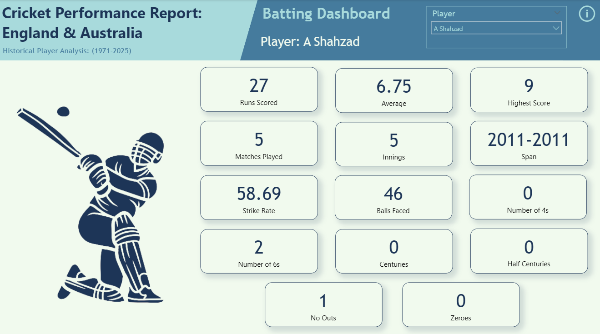
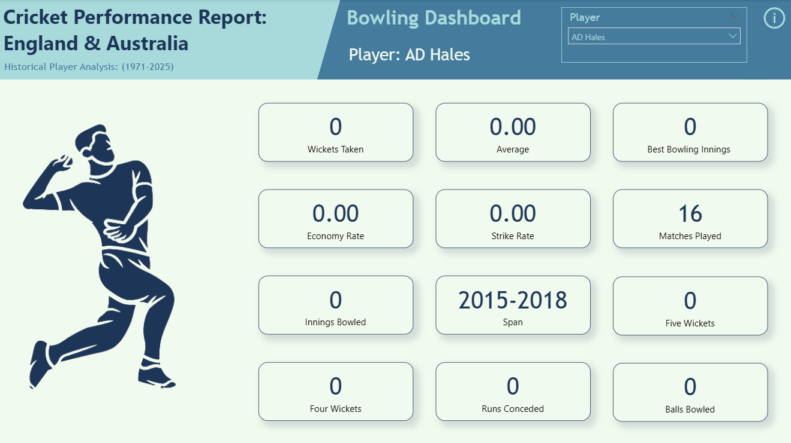
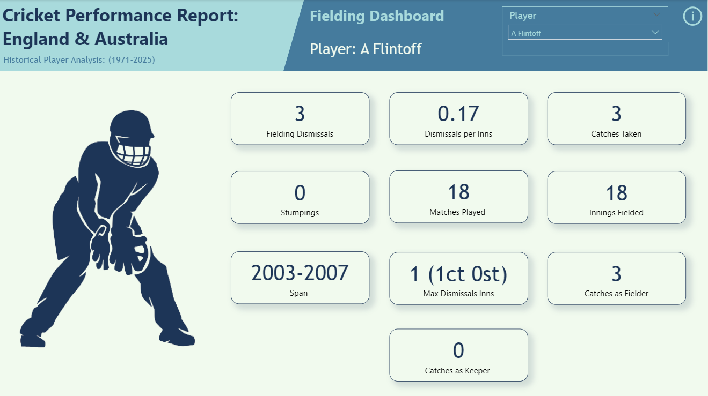

# ESPN-Cricket-England-vs-Australia-Analysis

This Power BI project provides a comprehensive performance analysis of **player statistics** from all One-Day International (ODI) cricket matches between **England and Australia** from **January 5, 1971 to September 7, 2025**.

---

## Objectives

- Analyze player performance across batting, bowling, and fielding dimensions
- Create an interactive dashboard for exploring historical Ashes ODI data
- Demonstrate web scraping, data transformation, and visualization skills

---

## Tools & Technologies

- **Power BI:** Data scraping, cleaning, and dashboard building
- **Power Query:** Data preparation and transformation
- **ESPN Cricinfo Statsguru:** Source for cricket records
- **Git & GitHub:** For version control and project hosting

---

## Project Structure

| Folder        | Description                                 |
|---------------|---------------------------------------------|
| `powerbi/`    | Power BI dashboard screenshot                                  |
| `data/`       | Metadata/ # Data dictionary and column descriptions            |
| `README.md`   | Project documentation                                          |
| `LICENSE`     | MIT License file (permissions & usage)                         |

---

## Data Sources

- [Batting Data](https://stats.espncricinfo.com/ci/engine/stats/index.html?class=2;opposition=2;team=1;template=results;type=batting)
- [Bowling Data](https://stats.espncricinfo.com/ci/engine/stats/index.html?class=2;opposition=2;team=1;template=results;type=bowling)  
- [Fielding Data](https://stats.espncricinfo.com/ci/engine/stats/index.html?class=2;opposition=2;team=1;template=results;type=fielding)

---

## Data Collection

**Method:** Power BI web scraping from three endpoints:
- Batting Records
- Bowling Records  
- Fielding Records

---

## Data Cleaning & Transformation

The scraped data was loaded into **Power Query**, and cleaned with the following steps:
- Structured header rows and appended to respective tables
- Corrected error values in critical columns
- Standardized data types across all tables
- Created **metadata table** for data documentation

---

## Dashboards & Visuals

The cleaned tables were imported into **Power BI**, and a multi-page report was built with:
- **Three Interactive Pages:** Batting, Bowling, and Fielding dashboards
- **KPI Cards:** Key performance metrics for quick insights
- **Player Selection:** Slicer for individual player analysis
- **User Guidance:** Pop-up information buttons explaining data context

**Dashboard Preview**  

Batting Page:

Bowling Page:

Fielding Page:

Power BI file: [Download from Google Drive](https://drive.google.com/file/d/1ziykHzHodeGddTPwpMYNXIRvHCPbX-Hw/view?usp=sharing)

---

## Key Insights

- **Batting:** **JH Edrich** shows the best **batting average** with **82%** in one year only (1971-1971)
- **Bowling:** **AU Rashid** has an eminent number of taken wickets with **51**, and **JM Anderson** has **38** wickets which is a big difference
- **Fielding:** **JC Buttler** made **61** fielding dismissals in 12 years, and after him is **AJ Stewart** with **25** in 14 years

---

## Limitations

During the analysis, certain limitations were identified:
- **Player Nationality:** The scraped data does not explicitly state the nationality of each player, which could limit certain types of geographical analysis
- **Match-Specific Statistics:** The dataset lacks individual match-level statistics, meaning the analysis is primarily aggregated at the player career level rather than match-by-match performance. This restricts the ability to perform detailed match scenario analysis

---

## License

This project is licensed under the [MIT License](LICENSE)

---

## Author

**Aymen Mohammed** — Data Analyst passionate about using data to tell stories and drive business decisions.

 
 
 

